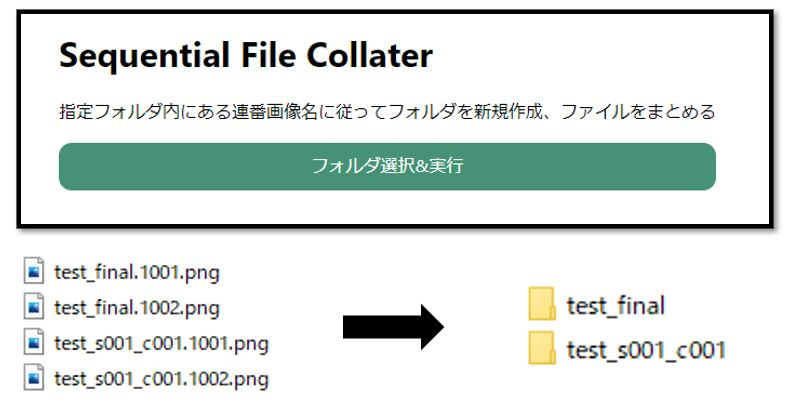
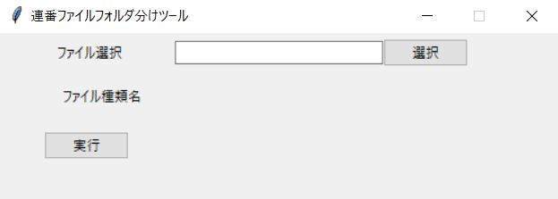

# 連番画像に合わせたフォルダ生成
「○○.01.png」「○○.02.png」などの場合に「○○」という名称のフォルダを生成します。
拡張子は「png」「jpg」に対応。

# 正規版
Electronを用いて作成。使用言語：JavaScript。実行ファイルは容量が大きいため非公開。


- ソースコード（app/srcフォルダ内）

appフォルダ内において以下のコマンドを実行
```bash
npm install
npm start
```

# プロトタイプ版
Tkinterを用いて作成。使用言語：Python。
pyinstallerを用いて実行ファイル化。


- 実行ファイル（prototype/test.exe）
- ソースコード（prototype/test.py）   

### 注意事項
「ピリオド(.)」を検出しているアルゴリズムのため、「○○01.jpg」のような名称ではなく、
「**○○.01.png**」のようなものでなければいけません。

### 参考サイト
[【Python】tkinterでファイル&フォルダパス指定画面を作成する](https://qiita.com/dgkmtu/items/2367a73f7e2d498e6075)

### 発想元
https://twitter.com/bearshu/status/1466669324928958464?s=20